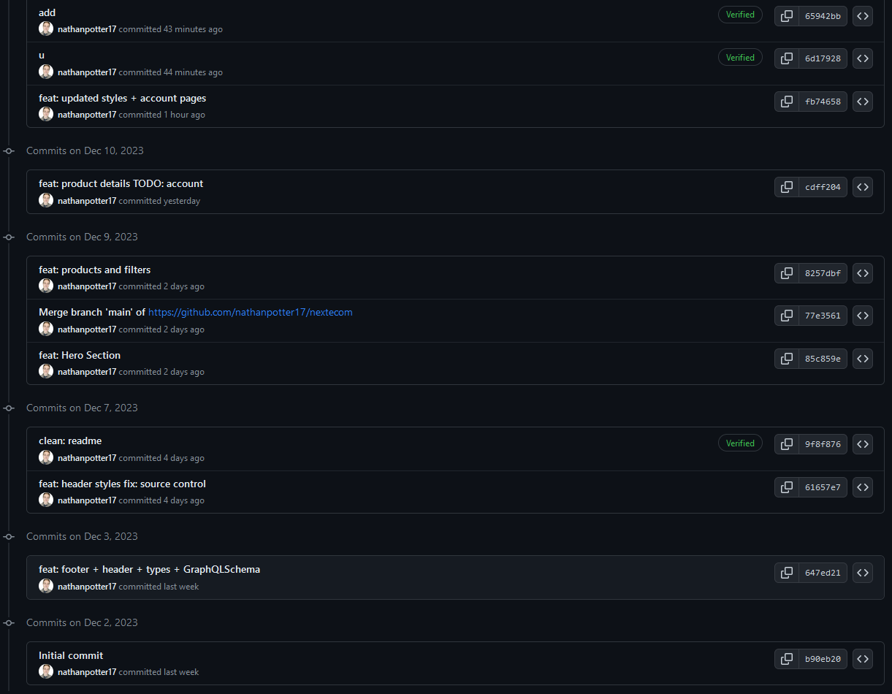
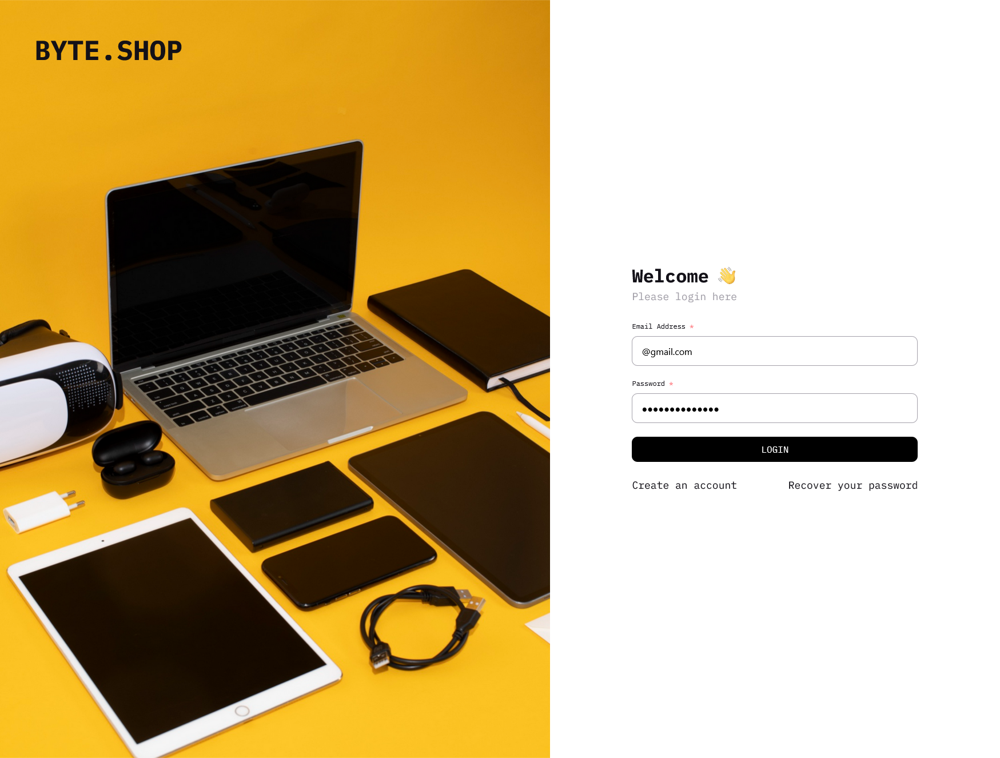
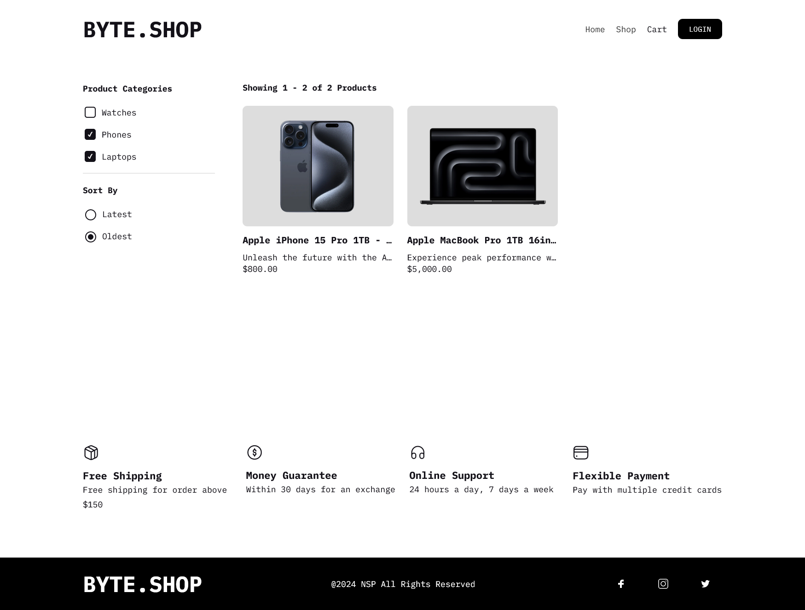
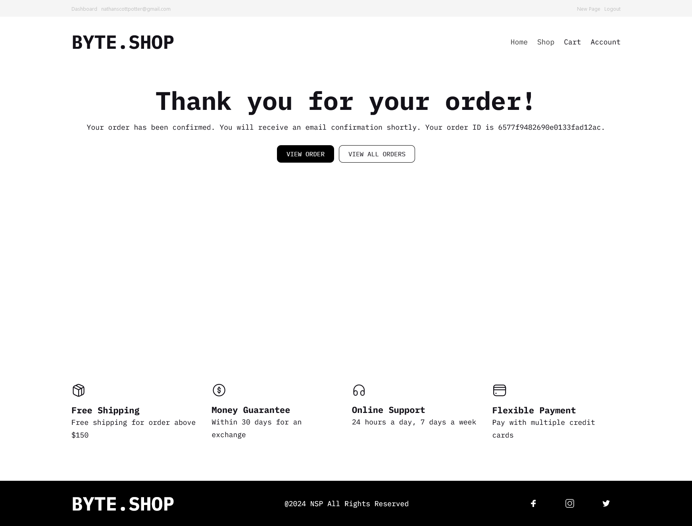

# Next E-Commerce Powered by Stripe and Payload

This project is a TypeScript project powered by Payload, an amazing new way to do e-commerce in 2024. 

I had a great time diving into this template, deciding to simulate day-to-day feature delivery inside a larger, unfamiliar codebase - just like if I was starting a new job or contract.
Creating a fully functional tech store connected to Stripe has showed me the incredible flexibility of this template, and of course, has made me confiddent in wielding Payload's CMS, design system, and component library.

**I would 100% use this template, and my learnings from it, for any project where the only acceptable standard of quality is 'production ready'.**

[Payload](https://github.com/payloadcms/payload/blob/main/templates/ecommerce)

### Checkins

### Homepage

### Login

### Logged in (Admin)

### All Products

### Filter Items by Type and Date

### Product Details

### Cart

### Purchase

### Successful Order

### User Account Management

### Orders

